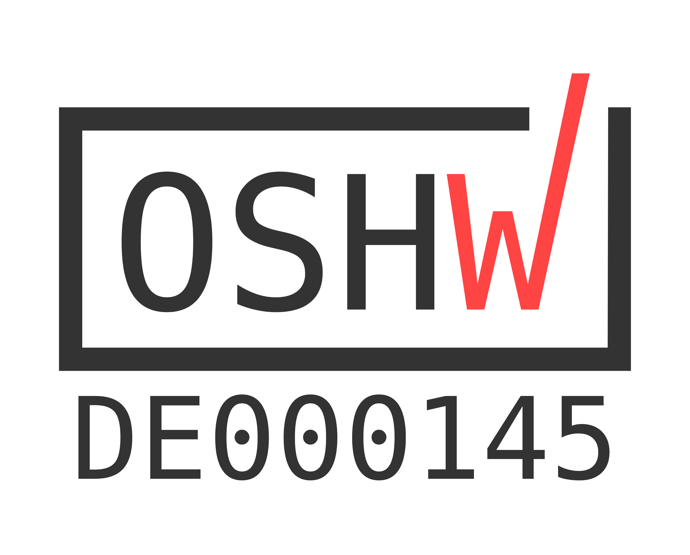

# ISOBUS Hardware

Welcome to the **ISOBUS Hardware** repository by **Meisterschulen am Ostbahnhof, München**. This repository hosts hardware designs for Open Source ISOBUS ECUs.

## 📂 Projects

### [Hutschienenmoped](./Hutschienenmoped)
The **Hutschienenmoped** is an Open Source ISOBUS ECU designed for DIN rail mounting.

* **📂 Source Code:** [View Directory](./Hutschienenmoped)
* **📖 Documentation:** [Read the Docs](https://install-isobus-environment-docs.readthedocs.io/de/latest/HutschienenMoped.html)

---

### [Hutschienenmoped XL](./Hutschienenmoped-XL)
The **Hutschienenmoped XL** is an extended version of the Open Source ISOBUS ECU.

* **📂 Source Code:** [View Directory](./Hutschienenmoped-XL)
* **🏅 Open Hardware:** Certified under [DE000145](https://certification.oshwa.org/de000145.html)

## 📜 License

This project is licensed under a **Creative Commons Attribution-ShareAlike 4.0 International License (CC BY-SA 4.0)**.

* **Hutschienenmoped** by Meisterschulen am Ostbahnhof, München
* **ISOBUS_Hardware** by Meisterschulen am Ostbahnhof, München

